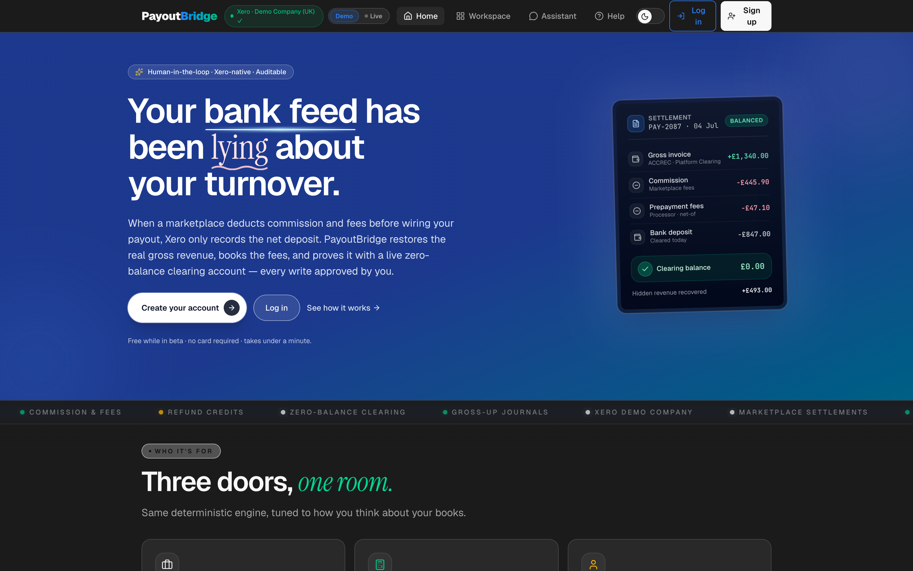

# PayoutBridge

**Your bank feed has been lying about your turnover.**

When a business sells through a marketplace, the platform skims commission and fees before
wiring the net payout — and Xero's bank feed books only that net figure as revenue. On one
demo statement that hides **£493** of turnover and makes commission expense invisible.

PayoutBridge is a Xero-native agent that reads the marketplace CSV, proposes the corrected
clearing-account accounting in plain English, posts three ordered writes to Xero **after a
human approves**, and proves the fix with a live zero-balance check.

**Live demo (Demo mode, works logged-out):**
https://supawichza40.github.io/Encoder-xero-app-and-agent-hackathon/



## Why it matters

| Item | Amount |
|---|---|
| Gross sales | £1,340.00 |
| Commission (35%) | £445.90 |
| Prepayment fees | £47.10 |
| **Net payout (all Xero sees)** | **£847.00** |

PayoutBridge restores the full £1,340 turnover, surfaces the £493 of expense, and returns
the clearing account to £0.00 as proof.

## The golden path

Three ordered Xero writes, then verification:

1. `create-invoice` — gross £1,340.00 into Platform Clearing
2. `create-bank-transaction` — commission £445.90 + fees £47.10 out of Clearing
3. `create-payment` — £847.00 clears against the seeded bank deposit
4. Verification read — Platform Clearing = **£0.00**
5. P&L before/after — revenue £847 → £1,340, expenses — → £493

The planner enforces `gross − commission − fees − refunds === net` and refuses to propose
if it fails. Every write needs explicit human approval. Idempotency is per-step, keyed on
`sha256(file_bytes)`, so a crash mid-sequence resumes without double-posting.

This path has been run end-to-end against the live Xero Demo Company — the clearing
account reached a genuine £0.00 on a real tenant, not a mock. Screenshots:
[proposal](./screenshots/04-proposal.png) · [verified £0.00](./screenshots/05-verified.png).

## Beyond the golden path

- **Persona workspaces** — Owner, Bookkeeper, and Freelancer each get a role-tuned
  dashboard (KPI ordering, jargon-free labels, tax summary for freelancers).
- **Streaming assistant** — a data-aware chat assistant (Ollama Cloud) with a
  Fast/Thinking toggle. The money-posting path stays fully deterministic; the LLM never
  posts anything ([`screenshots/03-assistant-chat.png`](./screenshots/03-assistant-chat.png)).
- **Audit export & evidence pack** — `GET /audit/export` (CSV/JSON, with a CSV
  formula-injection guard) and `GET /evidence-pack/{file_hash}` bundle the full trail
  for an accountant or auditor.

## Run it

### Backend (Python / FastAPI)

`backend` is a package, so run uvicorn from `src/`:

```bash
cd src/backend
pip install -r requirements.txt
cd ..
uvicorn backend.main:app --reload --port 8000
```

10 endpoints: `POST /propose`, `POST /approve`, `GET /status/{file_hash}`, `GET /pnl`,
`GET /dashboard`, `GET /vat-check`, `GET /audit/export`, `GET /evidence-pack/{file_hash}`,
`GET /health`, `POST /seed`.

Tests:

```bash
cd src/backend && pytest        # 199 passing (unit + mock-Xero API tiers)
```

### Frontend (React / Vite / TanStack — Bun)

```bash
cd src/frontend
bun install
bun dev            # opens with mock data, no backend needed
bun run test       # 139 passing across 20 files (vitest)
```

The app defaults to a built-in mock layer, so the hosted link works with no backend. Add
`?mock=0` (or set `VITE_API_URL`) to hit the real backend.

## Xero integration

All standard accounting operations run through the **Xero MCP server**
(`@xeroapi/xero-mcp-server`) via an MCP subprocess; attachments and history notes use raw
Xero REST. Auth is a **Custom Connection** against the **Xero Demo Company (UK)** only — the
live tenant is never touched. Full endpoint and scope inventory: [`XERO-API.md`](./XERO-API.md).

## Tech

Python 3.12 · FastAPI · Pydantic v2 · MCP Python SDK · React 19 · Vite · TanStack Router ·
Tailwind · Bun. Built with Claude Code + Lovable; optional Make scenario for email-to-agent
ingestion.

## Scope, honestly

The refund path (adds `create-credit-note`) and channel tracking are implemented. Demo data
is synthetic — the only marketplace brand shown is "MarketplaceCo". No PDF/OCR, no live
marketplace APIs, no VAT splitting (the optional check only reads and flags), no
delete/void.
